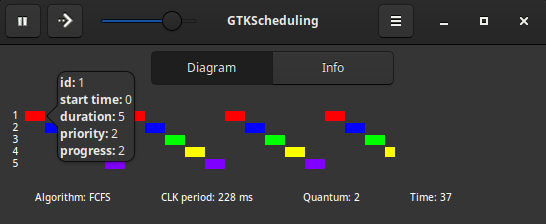
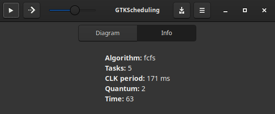

# GTKScheduling (in development)

GTKScheduling is GTK 3 based app to simulate CPU scheduling.

<p align="center" width="100%">


</p>

## Requirements
This GTK 3 based app uses [PyGObject](https://pygobject.gnome.org/), which is a Python package that provides bindings for GObject based libraries such as GTK, GStreamer, WebKitGTK, GLib, GIO and many more.

The dependencies usually come pre-installed on popular Linux distributions with GUI, such as:
- Debian 13: GNOME, Cinnamon, Xfce, LXDE, Junior
- Ubuntu 22.04: GNOME
- Ubuntu 25.10: Cinnamon, MATE, LXQt (Lubuntu), Unity, Budgie
- Mint 22: Cinnamon, Xfce, MATE
- Fedora 42: GNOME, KDE

However some they do not come with the package 'python3-gi-cairo' by default, such as:
- Ubuntu 24.04: GNOME
- Ubuntu 25.10: GNOME, KDE (lKubuntu)
- Debian 13: KDE, MATE, LXQt

To install it on Debian-based distributions:
```sh
sudo apt install python3-gi-cairo
```

If you wish to configure on other operating systems, including Windows, follow the instructions on the [PyGObject website](https://pygobject.gnome.org/getting_started.html), making sure to replace 'GTK4' with 'GTK3' when instaling packages.

## Setup:
To launch the app directly from the desktop environment, there is a Shell script which after executed will add a desktop entry to ~/.local/share/applications/gtk-scheduling.desktop and also setup the scripts/launcher.sh that will be called to start the app.

To add the entry:
```sh
sh scripts/setup_desktop_entry.sh
```

You can also directly run the app with:
```sh
sh scripts/launcher.sh
```
or:
```sh
python3 src/main.py
```

## Configure scheduling parameters:
The scheduling parameters can be changed by editing the data/tasks file.
