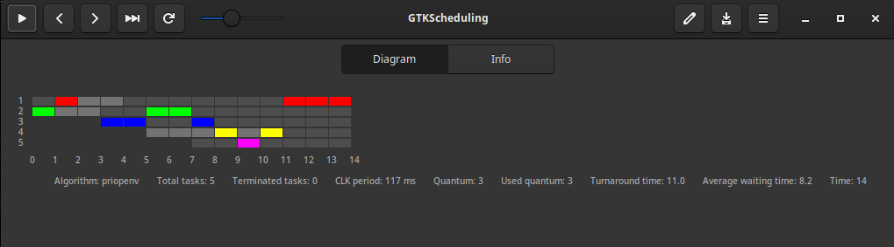
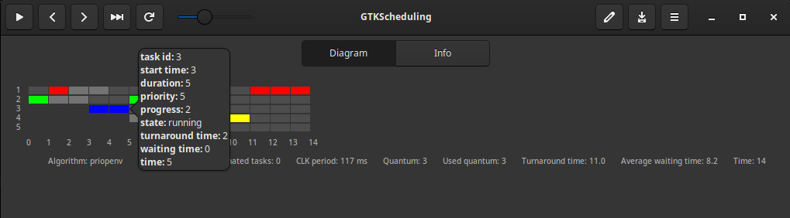
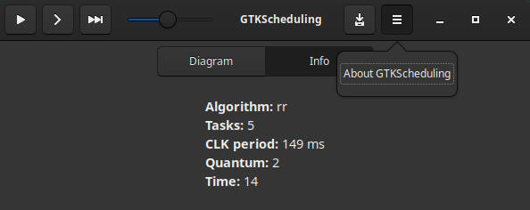

# GTKScheduling

GTKScheduling is GTK 3 based app to simulate CPU scheduling.

<p align="center" width="100%">



</p>

## Install
See [INSTALL](./INSTALL.md)

## Run the app
Launch the app from the application menu or run:
```sh
gtkscheduling
```

## Configure scheduling parameters
The scheduling parameters can be changed by editing the file data/tasks.

## License
[GPLv3](./LICENSE)

Copyright 2025-2026 Omar Zagonel El Laden\
Copyright 2025      Gabriel Martines
