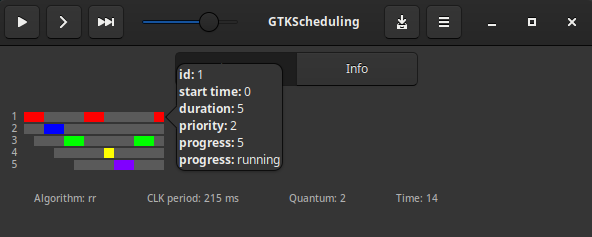

# GTKScheduling

GTKScheduling is GTK 3 based app to simulate CPU scheduling.

<p align="center" width="100%">



</p>

## Requirements
The dependencies usually come pre-installed on popular Linux distributions,
however some do not come with the package python3-gi-cairo installed by default.

To install all dependencies on Debian:
```sh
sudo apt install gir1.2-gtk-3.0 python3-gi python3-gi-cairo xdg-utils
```

To configure on other operating systems, including Windows, follow the instructions
on the [PyGObject website](https://pygobject.gnome.org/getting_started.html),
making sure to replace the GTK 4 packages with the corresponding GTK 3 ones on installation.

## Configure scheduling parameters
The scheduling parameters can be changed by editing the data/tasks.

## Install the app on Linux
```sh
sudo scripts/install.sh
```
After installing, you can launch the app from the application menu of your
desktop environment or run:
```sh
gtkscheduling
```

## Uninstall app
```sh
sudo scripts/uninstall.sh
```
